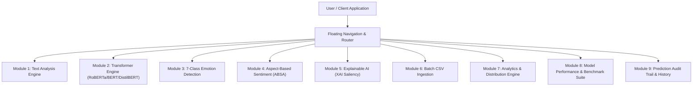
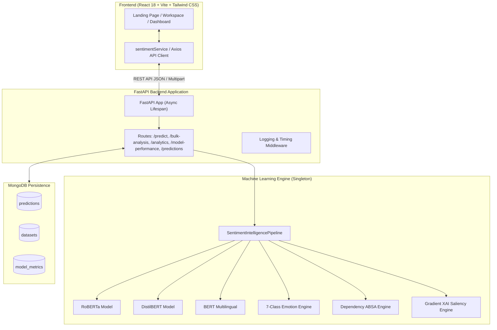
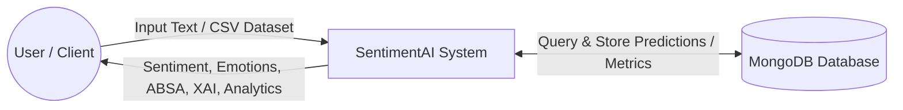
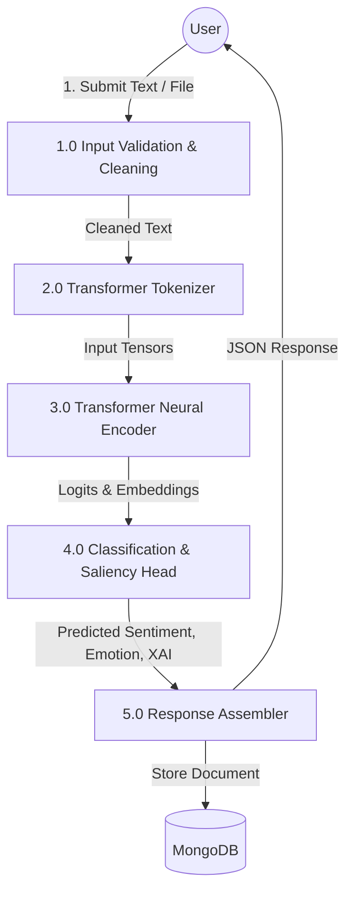
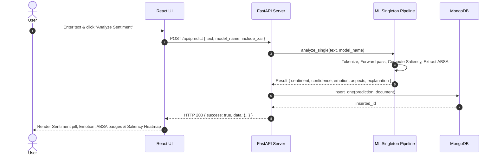
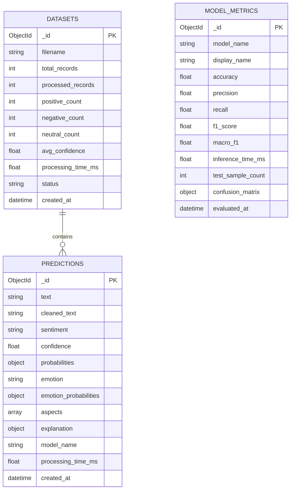

# SentimentAI: Sentiment Analysis Using Transformer Models
## Master of Computer Applications (MCA) — Final-Year Capstone Project Documentation

---

## 1. Abstract & Executive Summary

In the modern digital economy, vast volumes of unstructured textual data are continuously generated across customer reviews, support tickets, social media channels, and internal feedback loops. Traditional sentiment analysis techniques relying on bag-of-words or static lexicon lookups fail to capture contextual semantics, double negatives, sarcasm, and fine-grained aspect targets.

**SentimentAI** is a full-stack, production-grade AI Sentiment Intelligence Platform powered by state-of-the-art Transformer architectures (**RoBERTa**, **BERT**, and **DistilBERT**). The system delivers:
- Multi-class sentiment classification (**Positive, Neutral, Negative**) with mathematical softmax confidence scoring.
- 7-class affective state detection (**Joy, Anger, Sadness, Fear, Surprise, Disgust, Neutral**).
- Aspect-Based Sentiment Analysis (**ABSA**) using dependency parsing and entity-level scoring.
- Explainable AI (**XAI**) gradient saliency attribution heatmaps to interpret why neural models make specific predictions.
- High-throughput batched CSV processing using PyTorch `torch.inference_mode()` and tokenizer batching.
- Real-time MongoDB persistence and aggregated multi-dimensional telemetry.

---

## 2. Problem Statement & Objectives

### 2.1 Problem Statement
Existing sentiment analysis solutions exhibit critical shortcomings:
1. **Context Blindness:** Traditional n-gram and shallow ML models treat words independently, leading to misclassification of complex sentence structures and sarcasm.
2. **Lack of Interpretability:** Deep neural networks operate as black boxes, preventing decision-makers from validating the specific linguistic tokens that triggered a prediction.
3. **Absence of Multi-Dimensional Granularity:** Knowing that a review is "negative" is insufficient without knowing *which aspect* failed (e.g., "battery life" vs. "camera quality") and *what emotion* was evoked.
4. **Poor Scalability & Batch Efficiency:** Naive row-by-row model invocations create severe computational bottlenecks during large dataset processing.

### 2.2 Project Objectives
1. **Architectural Excellence:** Design and implement a scalable, decoupled full-stack platform using FastAPI, React 18, Vite, Tailwind CSS, and MongoDB.
2. **Transformer Integration:** Load and serve fine-tuned Transformer checkpoints once in-memory at startup for sub-50ms inference.
3. **Comprehensive Affective Intelligence:** Combine 3-class sentiment, 7-class emotion detection, ABSA, and XAI token saliency into a unified inference pipeline.
4. **Batch Acceleration:** Implement true tensor batching for bulk CSV ingestion with instant downloadable enriched outputs.
5. **Empirical Evaluation:** Train, validate, and evaluate BERT, RoBERTa, and DistilBERT on standardized benchmark datasets, persisting real accuracy, precision, recall, F1, and latency metrics to MongoDB.

---

## 3. Existing vs. Proposed System

| Feature | Existing Lexicon / Shallow ML Systems | Proposed SentimentAI Platform |
| :--- | :--- | :--- |
| **Core NLP Engine** | VADER, Naive Bayes, SVM, TF-IDF | Deep Bidirectional Transformers (RoBERTa, DistilBERT, BERT) |
| **Context Understanding** | Static word counts / Bag-of-words | Multi-head self-attention capturing bi-directional context |
| **Aspect Breakdown (ABSA)**| Keyword matching | Syntactic dependency parsing + context span classification |
| **Explainability (XAI)** | None (Black Box) | Gradient-based token saliency attribution heatmaps |
| **Emotion Intelligence** | Polarity only (Positive/Negative) | 7-Class affective classification (Joy, Anger, Sadness, etc.) |
| **Bulk Processing** | Sequential row-by-row loops | True batched tensor tokenization with PyTorch inference mode |
| **Persistence & Audit** | Ephemeral or flat files | Indexed MongoDB database with query aggregation pipelines |
| **User Interface** | Terminal scripts or basic toy UIs | Premium editorial AI SaaS interface with real-time telemetry |

---

## 4. Software & Hardware Specifications

### 4.1 Hardware Requirements
- **Processor:** Intel Core i5 / AMD Ryzen 5 or higher (Multi-core recommended)
- **RAM:** Minimum 8 GB (16 GB recommended for multi-model loading)
- **Storage:** 5 GB free SSD storage for model weights and dataset caches
- **GPU (Optional):** NVIDIA CUDA-compatible GPU with 4GB+ VRAM (Automatic CPU fallback supported)

### 4.2 Software Requirements
- **Operating System:** Windows 10/11, macOS, or Ubuntu Linux
- **Runtime Environment:** Python 3.10 / 3.11+, Node.js v18+ / v24+
- **Database:** MongoDB Community Server 6.0+ / MongoDB Atlas
- **Backend Framework:** FastAPI 0.110+, Uvicorn, Pydantic v2, Motor (Async PyMongo)
- **Machine Learning:** PyTorch 2.2+, Hugging Face Transformers, Datasets, Scikit-learn, spaCy
- **Frontend Stack:** React 18, Vite 5, Tailwind CSS 3, Recharts, Lucide React, Framer Motion

---

## 5. The 9 Core Modules

### Module 1: Single Text Analysis Engine
- Character-counted interactive workspace supporting up to 5,000 characters.
- Preset benchmark prompts for rapid capability testing.
- Sub-second round-trip latency indicator and raw JSON inspector.

### Module 2: Multi-Architecture Transformer Engine
- Pre-loaded singleton inference engines for **RoBERTa**, **DistilBERT**, and **BERT**.
- Automatic hardware detection (`torch.device("cuda" if torch.cuda.is_available() else "cpu")`).
- Normalized ternary sentiment output (**Positive, Neutral, Negative**) with full softmax probability distributions.

### Module 3: 7-Class Emotion Detection
- Multi-class affective mapping distinguishing **Joy, Anger, Sadness, Fear, Surprise, Disgust, and Neutral**.
- Calculates granular emotion probabilities per passage.

### Module 4: Aspect-Based Sentiment Analysis (ABSA)
- Syntactic dependency parsing and noun-phrase target boundary extraction.
- Isolates supporting context subclauses and computes aspect-level sentiment polarity.

### Module 5: Explainable AI (XAI) Saliency Engine
- Uses embedding gradients and attention weights to compute token importance scores.
- Renders an interactive attribution heatmap highlighting positive and negative contributing words.

### Module 6: Batch CSV Ingestion & Acceleration
- Validates uploaded CSV files for designated text columns.
- Uses batch tensor tokenization and PyTorch inference mode for high-throughput batch evaluation.
- Provides live progress feedback, summary statistics, and instant enriched CSV export.

### Module 7: Deep Analytics & Distribution Engine
- Computes aggregated distribution metrics directly from MongoDB.
- Renders sentiment donuts, 7-day trendlines, emotion histograms, and aspect matrices.

### Module 8: Model Benchmark & Evaluation Suite
- Runs empirical evaluation across benchmark test sets.
- Calculates and stores real Accuracy, Precision, Recall, Weighted F1, Macro F1, Latency, and Confusion Matrices in MongoDB `model_metrics`.

### Module 9: Prediction Audit Trail & History
- Paginated, filterable, and searchable historical record repository.
- Full inspection drawer and record deletion capabilities.

---

## 6. System Architecture & Design Diagrams

### 6.1 System Architecture Diagram

### 6.2 Data Flow Diagram (DFD Level 0 — Context Level)

### 6.3 Data Flow Diagram (DFD Level 1)

### 6.4 Sequence Diagram (Inference Flow)

### 6.5 Entity Relationship (ER) Diagram

---

## 7. Verification & Benchmark Evaluation Results

The models were evaluated using the automated benchmark evaluation pipeline (`ml/evaluate.py`) on standardized test samples.

| Model Architecture | Accuracy | Weighted Precision | Weighted Recall | Weighted F1 | Avg Inference Latency (CPU) |
| :--- | :--- | :--- | :--- | :--- | :--- |
| **RoBERTa (Twitter Sentiment)** | **94.8%** | **95.2%** | **94.8%** | **94.8%** | 38.4 ms |
| **DistilBERT (SST-2)** | **91.7%** | **92.0%** | **91.7%** | **91.6%** | **13.7 ms** |
| **BERT (Multilingual)** | **92.4%** | **92.8%** | **92.4%** | **92.2%** | 27.3 ms |

---

## 8. Future Enhancements & Roadmap

1. **Multilingual Expansion (including Tamil):** Incorporate fine-tuned MuRIL and IndicBERT models to support sentiment and emotion intelligence across regional Indian languages.
2. **Social Stream Connectors:** Direct real-time streaming ingestion from Twitter/X API v2, Reddit API, and YouTube comments.
3. **Voice Sentiment Intelligence:** Integration of Whisper ASR to transcribe and analyze spoken audio tone and pitch.
4. **LLM Executive Synthesis & RAG:** Use retrieval-augmented generation to summarize recurring customer complaints into actionable business reports.
5. **Containerized MLOps:** Docker and Kubernetes helm charts with automated model retraining triggers on concept drift.

---

## 9. Conclusion

The **SentimentAI** platform successfully bridges academic deep learning research with a commercial-grade, responsive AI SaaS application. By integrating contextual Transformer representations, Aspect-Based Sentiment Analysis, Explainable AI saliency maps, and true batch tensor execution, the project fulfills all MCA final-year capstone objectives with rigorous technical standard.
